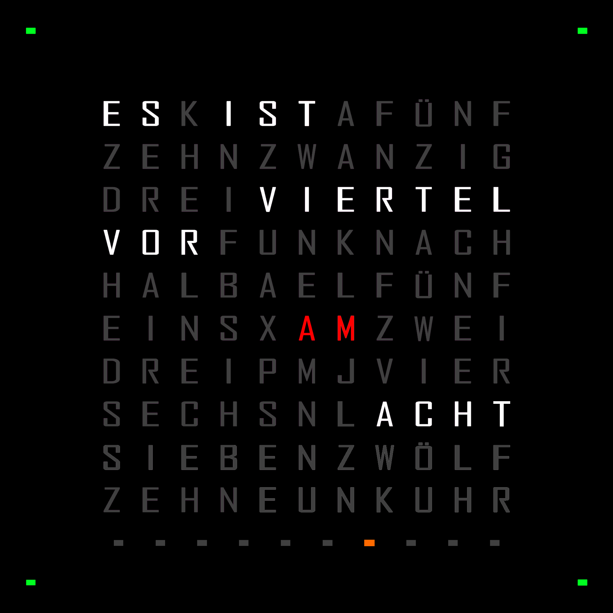
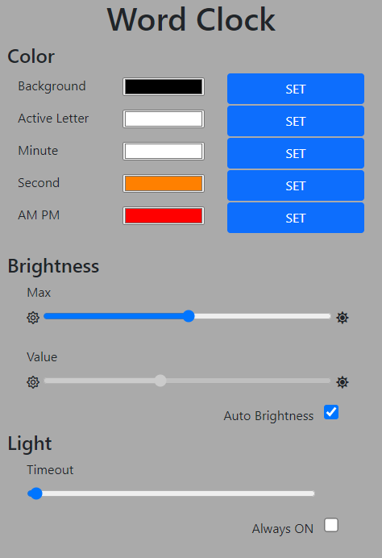

# Word Clock DE

**Word Clock DE** is an advanced version word clock in german language. This version of word clock is equipped with different sensor units and contains extended features such as web application to configure multiple options. The whole software is written in Python.



## Table of Content
- [Word Clock DE](#word-clock-de)
  - [Table of Content](#table-of-content)
  - [Requirements and Instructions](#requirements-and-instructions)
  - [Features](#features)
    - [Web Application](#web-application)
    - [Set Color](#set-color)
    - [Motion Detector](#motion-detector)
    - [Brightness Sensor](#brightness-sensor)
    - [Seconds View](#seconds-view)
    - [AM/PM View](#ampm-view)
  - [Usage](#usage)
  - [License](#license)

## Requirements and Instructions
For requirements and instruction please refer to [Handbook](doc/handbook.md).

## Features

### Web Application
The **Word Clock DE** provides web application that can be accessed from different devices. The current setup of the web server is using the connection over the router. As long as your device is connected to your router, you can open the web application to configure your clock.

<!--  -->
<div style="text-align:center"></div>

### Set Color
There are multiple colors that you can set with the web application
* Background Color  
  You can set the background color of the clock. In this context the background color is meant for the color of the inactive letters, that are not used to show the time.
* Active Letter Color  
  You can set the color for the active letters, that are used to show the current time.
* Minute Color
* Second Color
* AM/PM Color

### Motion Detector
The **Word Clock DE** is equipped with motion detection sensor to turn ON/OFF the LEDs, whenever it is necessary. This can reduce power consumption of the clock.  
The timeout of the sensor can be configured through the web application, and you can also set the clock to be always ON all the time.

### Brightness Sensor
The **Word Clock DE** provides you the possibility to configure the brightness of the LEDs, whether it is manually or automatically. The web application can be used to set this feature.

### Seconds View
The **Word Clock DE** is extended with view of the seconds, that is located under the letters area. You can also turn OFF this view by changing the color to black in the web application.

### AM/PM View
Since the clock can only show 12 hours format, the **Word Clock DE** provides the additional view of [*meridiem*](https://de.wikipedia.org/wiki/2-mal-12-Stunden-Z%C3%A4hlung) information.

## Usage
```
git clone https://github.com/afri-bit/word-clock-de.git
cd word-clock-de
pip install .

# Run the controller
wcctrl

# Run the web server
wcserver
```

## License
**Word Clock DE** is licensed under the [MIT](LICENSE) license.  
Copyright © 2021, Afrizal Herlambang